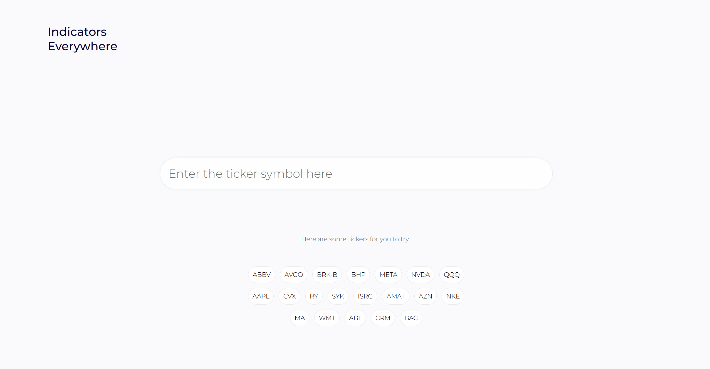
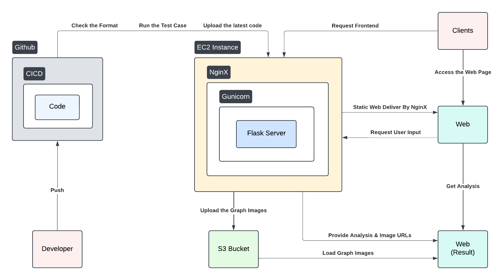
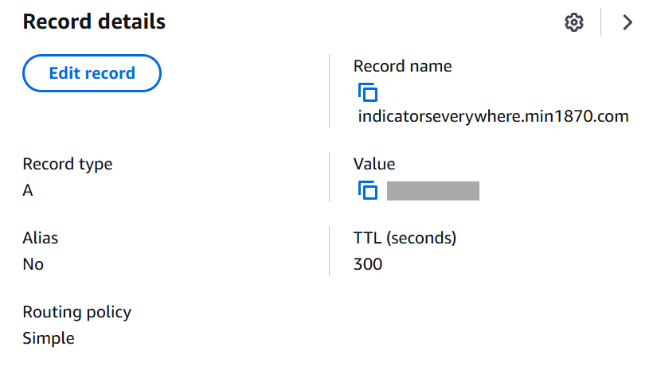

# Indicators Everywhere

# Project Demo

### 🔗[Link to Website](https://indicatorseverywhere.min1870.com/)

### Contributors:

- **Minseok Kim** (Developer) - [200134kms@gmail.com](mailto:200134kms@gmail.com)
- **Wonjun Kim** (Designer) - [alphamagnum02@gmail.com](mailto:alphamagnum02@gmail.com)

# **Problem Statement**

Many stock-related platforms provide excellent APIs to work with. I wanted to integrate my computing skills with these APIs to create useful data that helps beginners in the trading market, just like myself! While studying trading systems for this project, I discovered that traders use various indicators for their decisions. As a beginner, I wasn't sure which indicators were credible. This project aims to organize all these indicators in one place. Users don't need to understand how the indicators work—we'll provide clear explanations of the results and a summary for each indicator!

# Tech Stack

- **Cloud Infrastructure**
    - **S3 Bucket**
        - Storing graphs and static assets for the web site.
    - **EC2 Instance**
        - Hosting the Web Server, Frontend, Backend.
- **Web Server**
    - **Nginx**
        - Reverse Proxying between clients and backend servers.
        - Encrypting and decrypting traffic using HTTPS.
- **Frontend**
    - **HTML & CSS & JavaScript**
        - Markup and Styling for web page.
- **Backend**
    - **Flask**
        - Building the API logic for the server.
    - **Gunicorn**
        - Handles multiple concurrent requests.
    - **Yahoo Finance**
        - Fetch real-time and historical financial data.
    - **Pandas & Matplotlib**
        - Data manipulation and analysis.
        

# System Architecture Overview

The following diagrams illustrate the end-to-end flow of our stock analysis system, from client requests through data processing to response delivery.

# Implementation Details

### 1. Receiving request from a client

Users can access our web interface, hosted on an EC2 instance and served through Nginx, to request comprehensive stock analysis for any US ticker. The request routes through DNS (`indicatorseverywhere.min1870.com/api/~`) and reaches the API server via the EC2 instance's Elastic IP.

### 2. Calculating necessary indicators

Based on the request data, the server fetches historical financial data from Yahoo Finance. To optimize performance and resource utilization, the data retrieval is limited to a specific time frame.

Following data collection, the system performs comprehensive analysis of the available indicators, computing their  values and detecting signal triggers within the specified time frame.

The system send the computed signals, corresponding dates, and graph URLs to another function for comprehensive signal analysis. Subsequently, the graphs are stored temporarily in the instance's local storage before being uploaded to the S3 bucket via the `boto3`.

### 3. Analyse overall signals based on signals

The gathered data is analysed to produce a comprehensive summary of all indicators. Subsequently, the system restructures the output format, incorporating essential elements such as titles, detailed descriptions, and relevant URLs to formulate a well-organized response.

### 4. Return the analysis to the client

The final analysis results, including graphs, descriptions, and signal summaries, are sent back to the client through the API. The response is structured in a JSON format.

# Future Scope

- [ ]  Applying caching system
- [ ]  Adding more indicators in the world!